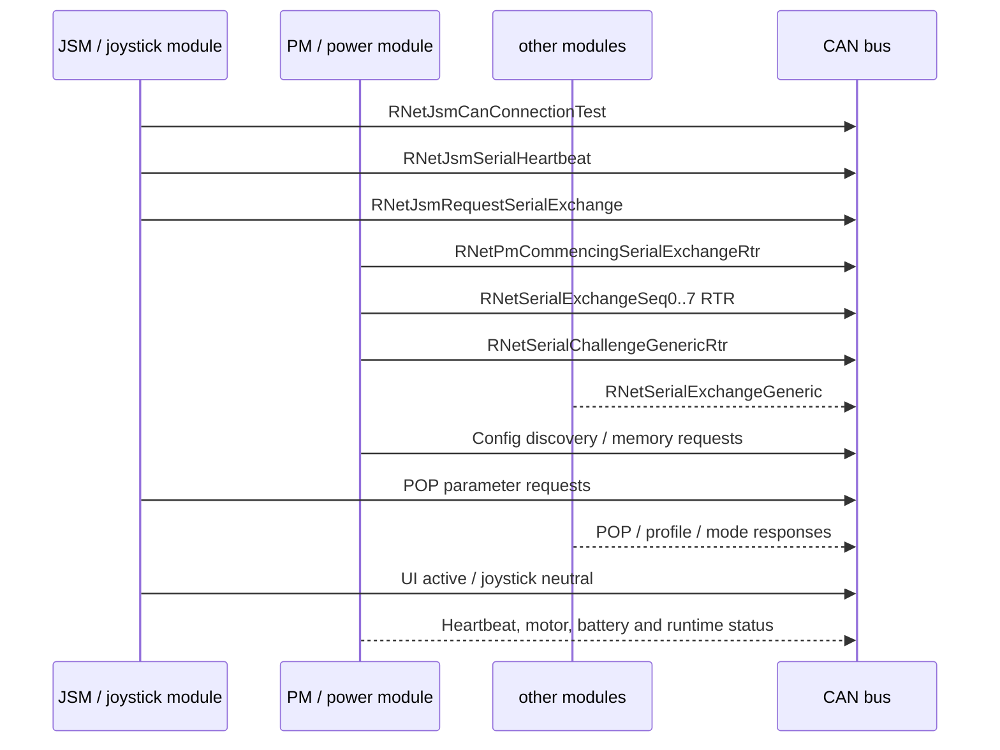

# Observed R-Net startup sequence

The exact sender is not present in candump logs. `quelle` and `senke` are therefore best-effort roles inferred from frame families.

## Phases used in JSON

- `startup.serial_auth`
- `startup.config_discovery`
- `startup.profile_mode`
- `startup.parameter_exchange`
- `runtime.normal_operation`
- `runtime.drive`
- `runtime.ui`
- `unknown.observed`
